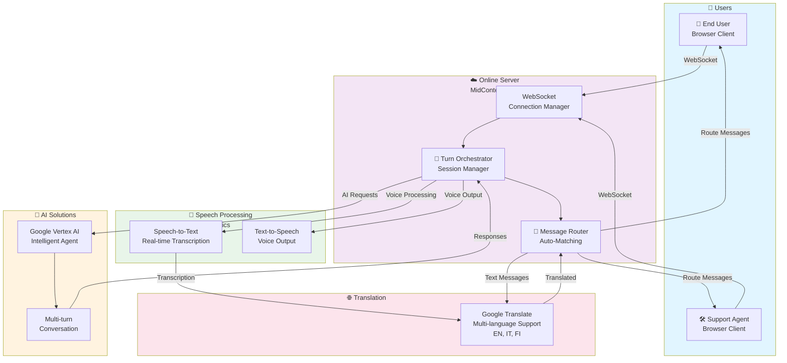

# MidContext - Real-Time Multilingual Support Chat

**MidContext** is a production-ready real-time multilingual support chat system with automatic language translation, voice support, and intelligent auto-matching of end users to IT support agents.

✅ **Works on Windows**

## 🖥️ System Requirements

### Windows PC
- **OS:** Windows 10 or newer (Home, Pro, Enterprise)
- **Processor:** Intel/AMD 2+ cores @ 2GHz minimum
- **RAM:** 4GB minimum (8GB recommended)
- **Storage:** 500MB free space
- **Browser:** Chrome, Edge, Firefox (any modern browser)
- **Microphone:** Working microphone for voice recording
- **Internet:** Stable connection (broadband recommended)

### What You Need to Install

#### 1. **Node.js** (Required)
- Download from [nodejs.org](https://nodejs.org/)
- Choose **LTS** version (Long Term Support)
- Windows installer will add Node.js to PATH automatically
- **Verify:** Open PowerShell and run:
  ```powershell
  node --version  # Should show v20.x.x or higher
  npm --version   # Should show 10.x.x or higher
  ```

#### 2. **Modern Web Browser** (Already installed)
- Chrome, Edge, or Firefox
- Must support:
  - WebSockets
  - Web Audio API
  - getUserMedia (microphone access)
- ✅ All Windows 10+ browsers support these

#### 3. **Working Microphone** (Hardware)
- Built-in laptop microphone, OR
- USB microphone, OR
- Headset with microphone
- **Test:** Right-click speaker icon → Sound settings → Input devices

#### 4. **Speechmatics API Key** (Free trial available)
- Sign up at [speechmatics.com](https://www.speechmatics.com)
- Get free API key for development
- Add to `.env` file (instructions below)

## Key Features

✨ **Auto-Matching** - End users automatically connect to first available IT support agent
🌍 **Bidirectional Translation** - All messages automatically translated based on language preferences
🎤 **Voice Support** - Record, transcribe, translate, and playback voice messages
🔄 **Status Management** - Automatic status tracking (free ↔ busy)
🎯 **Multi-Language** - English, Italian, Finnish with browser TTS
⚡ **Real-Time** - WebSocket-based instant messaging

## 📸 Application UI Overview

**Profile Selection Screen** - Users choose their role (IT Support or End User) and select their preferred language
- Options: English, Italian, Finnish
- Auto-matching system connects end users with first available support agent

**Chat Interface** - Real-time conversation with:
- Real-time speech transcription (Speechmatics STT)
- Message translation (Google Translate)
- Voice input/output with browser TTS
- Session status tracking
- Both text and voice messaging support

## 🏗️ System Architecture

MidContext connects users through an intelligent online server with real-time speech processing and multilingual translation:



### Architecture Components

- **Users**: End users and support agents connecting through web browsers
- **Online Server (MidContext)**: Central server managing WebSocket connections, session orchestration, and message routing
- **AI Solutions**: Google Vertex AI for intelligent multi-turn conversations
- **Speech Processing**: Speechmatics for real-time speech-to-text transcription and text-to-speech playback
- **Translation**: Google Translate for automatic multilingual support (English, Italian, Finnish)

## �🚀 Quick Start on Windows

### Easiest Way - Automated Setup
```powershell
# 1. Open PowerShell in your project folder
# 2. Run this command:
.\setup.ps1

# The script automatically:
# ✅ Checks if Node.js is installed
# ✅ Installs all dependencies
# ✅ Builds the TypeScript code
# ✅ Creates .env configuration
# ✅ Starts the development server
# ✅ Opens your browser to http://localhost:3000
```

**That's it!** Your app is running. Open 2 browser windows to test it.

### Manual Setup (Alternative)

```powershell
# 1. Install dependencies
npm install

# 2. Build TypeScript
npm run build

# 3. Start server
npm run dev

# 4. Open browser
Start http://localhost:3000
```

## 📖 First Time Setup on Windows

### Step 1: Download the Project
```powershell
# Clone from GitHub (if you haven't already)
git clone https://github.com/your-username/livetranslationkhack
cd livetranslationkhack
```

### Step 2: Install Node.js (if not installed)
```powershell
# Check if Node.js is installed
node --version

# If not installed:
# 1. Download from https://nodejs.org/
# 2. Run installer (node-v20.x.x-x64.msi)
# 3. Follow prompts - use default settings
# 4. Restart PowerShell
```

### Step 3: Allow Microphone Access
1. Open **Settings** → **Privacy & Security** → **Microphone**
2. Ensure your microphone is enabled
3. Windows apps should show "Allowed"

### Step 4: Run Setup Script
```powershell
# Navigate to project folder
cd path\to\LiveTranslationHack

# Run setup
.\setup.ps1

# If you get permission error:
# 1. Right-click PowerShell → Run as Administrator
# 2. Run: Set-ExecutionPolicy -ExecutionPolicy RemoteSigned -Scope CurrentUser
# 3. Then run .\setup.ps1 again
```

### Step 5: Test with 2 Browsers
```
Browser 1: http://localhost:3000
  → Select "IT Support"
  → Enter your name
  → Click "Start Session"

Browser 2: http://localhost:3000
  → Select "End User"
  → Enter your name
  → Click "Start Session"

Result: They auto-connect! 🎯
```

## 📖 How to Use

1. **Open app** at http://localhost:3000
2. **Select your role:**
   - 🛠️ **IT Support** - Wait for end users to connect
   - 👤 **End User** - Get connected to first available support agent
3. **Enter your name** and preferred language
4. **Click "Start Session"** - Auto-connects in seconds
5. **Voice or Text:**
   - Click "START LISTENING" to record voice message
   - Or type a message and click "Send"
6. **Transcription & Translation:**
   - Your voice → auto-transcribed (Speechmatics)
   - Auto-translated to recipient's language (Google Translate)
   - Appears in real-time conversation

## 🌐 Deploy Online

See **[DEPLOYMENT.md](DEPLOYMENT.md)** for complete step-by-step guides:

- 🚄 **Railway** (Recommended) - Auto-deploys in 2 minutes, free tier included
- ▲ **Vercel** - Free forever, auto-scaling
- 🦗 **Heroku** - Traditional PaaS
- 🐳 **Docker** - Deploy anywhere

All platforms have environment variable setup and testing instructions.

## Environment Variables

Create `.env` file in root:
```env
PORT=3000
HOST=0.0.0.0
LOG_LEVEL=info

# Speechmatics Configuration
SPEECHMATICS_API_KEY=your_key_here
SPEECHMATICS_BATCH_URL=https://asr.api.speechmatics.com/v2
SPEECHMATICS_RT_URL=wss://rt.speechmatics.com/v2
SPEECHMATICS_TTS_URL=https://tts.api.speechmatics.com/v2

# Vertex AI Configuration (optional)
VERTEX_PROJECT_ID=your-project-id
VERTEX_LOCATION=us-central1
VERTEX_AGENT_ID=your-agent-id
VERTEX_LANGUAGE_CODE=en-US
```

## Architecture

### Frontend (`public/`)
- `app.js` - WebSocket client, voice recording, message translation
- `index.html` - Profile selection, conversation UI
- `styles.css` - MidContext branding

### Backend (`src/`)
- `server/createServer.ts` - WebSocket server, message routing
- `sessions/multi-user-session-manager.ts` - Session lifecycle, auto-matching
- `providers/speechmatics/` - Voice transcription + translation
- `providers/translation/` - Google Translate API
- `providers/agents/` - LLM integration for agent responses

## How It Works

```
1. IT Support creates pool session
   ↓
2. Status: "free"
   ↓
3. End User joins
   ↓
4. Auto-match to first available agent
   ↓
5. Status changes to: "busy"
   ↓
6. User speaks → Audio recorded
   ↓
7. Speechmatics: Transcribe + Translate
   ↓
8. Message relayed with translation
   ↓
9. Recipient hears TTS in their language
```

## Demo Scenarios

### Text Translation
- **IT Support (English):** "What is your account number?"
- **End User (Italian):** Sees → "Qual è il numero del tuo account?"
- **End User replies (Italian):** "12345"
- **IT Support:** Sees → "12345" (auto-translated)

### Voice Translation
- **IT Support (English):** Clicks "Start Listening" → Says "How can I help?"
- **End User (Finnish):** Hears Finnish audio automatically

### Multi-Agent
- Multiple IT Support agents can be available
- Multiple end users auto-match to available agents
- All conversations run simultaneously

## 🏗️ Tech Stack

### Frontend
- **Language:** Vanilla JavaScript (no frameworks)
- **Audio:** Web Audio API (MediaRecorder, AudioContext, AnalyserNode)
- **Real-Time:** WebSocket Client
- **Styling:** CSS3 with custom branding
- **i18n:** Browser language detection

### Backend
- **Runtime:** Node.js 20+
- **Framework:** Fastify
- **Language:** TypeScript
- **Real-Time:** WebSocket (@fastify/websocket)
- **Static Files:** @fastify/static

### Services
- **Speech-to-Text:** Speechmatics Batch API
- **Text Translation:** Google Translate API
- **Session Management:** Custom in-memory session store
- **Auto-Matching:** Pool-based agent assignment

### Architecture
```
Client (Browser)
    ↓ WebSocket
Server (Fastify)
    ├── Session Manager (Pool/Direct modes)
    ├── Message Router
    ├── Speechmatics Client (STT)
    └── Translator (Google Translate)
```

## ✨ Key Features

| Feature | Status | Details |
|---------|--------|---------|
| **Voice Recording** | ✅ | Web Audio API with 2s silence detection |
| **Auto-Transcription** | ✅ | Speechmatics STT, real-time display |
| **Translation** | ✅ | Bidirectional (en ↔ it ↔ fi) |
| **Auto-Matching** | ✅ | Support agents + end users |
| **Multi-Language** | ✅ | English, Italian, Finnish |
| **Status Management** | ✅ | Free/Busy tracking |
| **Error Recovery** | ✅ | Auto-reconnect, fallback UI |
| **Mobile Responsive** | ✅ | Works on phones & tablets |
- Add message history
- Implement rating system
- Add queue management
- Support metrics/analytics

## 🧪 Testing

### Local Testing (2 Browsers)
```
Browser 1: http://localhost:3000
  → Select "IT Support" → Enter name → Start
  
Browser 2: http://localhost:3000
  → Select "End User" → Enter name → Start
  
Result: Auto-connected, can message/voice chat
```

### Multi-PC Testing
```bash
# On PC 1 (Server)
npm run dev

# Get IP address
ipconfig | findstr IPv4  # Windows
ifconfig                 # macOS/Linux

# On PC 2 (Client)
# Open http://<PC1_IP>:3000 in browser
```

## 🔧 Environment Setup

Create `.env` file in project root:

```env
# Required
PORT=3000
SPEECHMATICS_API_KEY=your_key_here

# Optional (defaults provided)
HOST=0.0.0.0
LOG_LEVEL=info
SPEECHMATICS_BATCH_URL=https://asr.api.speechmatics.com/v2
SPEECHMATICS_TTS_URL=https://tts.api.speechmatics.com/v2
```

## 📚 Documentation

- **[DEPLOYMENT.md](DEPLOYMENT.md)** - Deploy to Railway, Vercel, Heroku, Docker
- **[HACKATHON.md](HACKATHON.md)** - Demo checklist and testing guide
- **Source code** - Well-commented TypeScript in `src/`

## ❓ Troubleshooting

### Windows-Specific Issues

| Issue | Solution |
|-------|----------|
| **"PowerShell cannot execute script"** | Right-click PowerShell → "Run as Administrator"<br/>`Set-ExecutionPolicy -ExecutionPolicy RemoteSigned -Scope CurrentUser`<br/>Then run `.\setup.ps1` again |
| **Node.js not found** | Download from [nodejs.org](https://nodejs.org/)<br/>Run MSI installer (v20 LTS)<br/>Restart PowerShell after install |
| **"npm command not found"** | Node.js not in PATH<br/>Restart your computer after installing Node.js |
| **Port 3000 already in use** | `taskkill /IM node.exe /F`<br/>Then restart: `npm run dev` |
| **Microphone not working** | 1. Check Settings → Privacy & Security → Microphone<br/>2. Click browser notification "Allow microphone"<br/>3. Check Windows Sound settings for device |
| **Can't hear voice playback** | Check Volume mixer (right-click speaker icon)<br/>Ensure app volume is not muted<br/>Test speaker with YouTube |
| **Connection timeout** | Ensure `.env` file exists with SPEECHMATICS_API_KEY<br/>Check internet connection<br/>Verify firewall isn't blocking localhost:3000 |
| **"Cannot find module"** | Run `npm install` first<br/>Delete `node_modules` folder and run `npm install` again |
| **Browser won't load page** | Clear browser cache (Ctrl+Shift+Del)<br/>Try different browser (Chrome, Edge, Firefox)<br/>Check browser console (F12) for errors |

### General Issues

| Issue | Solution |
|-------|----------|
| Messages not translating | Check `.env` has valid SPEECHMATICS_API_KEY |
| No transcription appearing | Open browser console (F12) and check for errors |
| Two users can't see each other | Open `http://localhost:3000` in 2 separate browser windows<br/>Select different roles (Support vs End User) |
| Build fails | Delete `dist/` folder: `rmdir dist /s /q`<br/>Delete `node_modules` and run `npm install` |

### Quick Fixes

```powershell
# Fix Node.js not in PATH
$env:Path = [System.Environment]::GetEnvironmentVariable("Path","Machine") + ";" + [System.Environment]::GetEnvironmentVariable("Path","User")
node --version

# Clear everything and reinstall
Remove-Item node_modules -Recurse -Force
Remove-Item dist -Recurse -Force
npm install
npm run build
npm run dev

# Kill stuck node process
Get-Process node | Stop-Process -Force
```

## 📄 License

MIT - Free for personal and commercial use

## 🙌 Contributing

Found a bug or have ideas? Open an issue on GitHub!

---

**MidContext v1.0.0** - Production Ready
Built for Real-Time Multilingual Support 🌍🎤

- provider client stubs for Speechmatics STT, Speechmatics TTS, and Vertex

The provider methods are intentionally thin placeholders so you can wire the real APIs next without changing the service layout.
